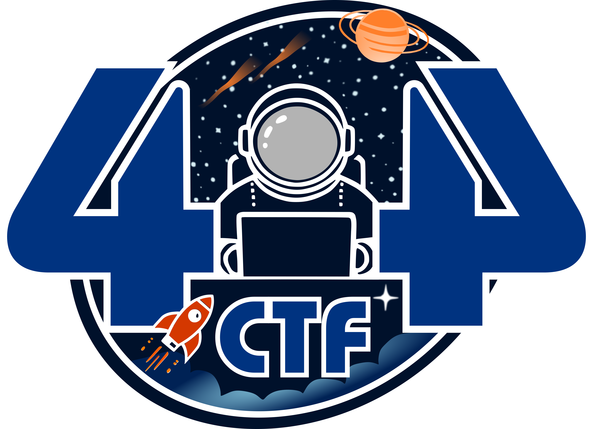

  
  <h1 style=>404 CTF - Édition 2025</h1>
  

    Ce dépôt contient les codes sources des challenges de l'édition 2025 du 404 CTF, éventuellement accompagnés de leurs solutions ou d'autres ressources complémentaires.
  

  
<i>
    This repository contains the source code for the challenges of the 2025 edition of the 404 CTF, often with their solutions or additional resources.
  </i>

  

    Éditions précédentes | <i>Previous editions</i>
     
    <a href="https://github.com/HackademINT/404CTF-2022">2022</a> | <a href="https://github.com/HackademINT/404CTF-2023">2023</a> | <a href="https://github.com/HackademINT/404CTF-2024">2024</a>
  

## Le 404 CTF

Coorganisé par la [Direction Générale de la Sécurité Extérieure](https://www.dgse.gouv.fr), [Télécom SudParis](https://www.telecom-sudparis.eu), [HackademINT](https://www.hackademint.org), [OVHcloud](https://www.ovhcloud.com) et [Viva Technology](https://vivatechnology.com), le 404 CTF est la plus grande compétition de cybersécurité de France. Après le succès des précédentes éditions, avec l'édition 2024 qui célébrait le monde du sport, le 404 CTF revient pour une quatrième édition sur le thème de l'espace ! L'édition 2025 s'est tenue du 10 mai au 1er juin 2025 et a rassemblé près de 3400 participants autours de 84 challenges conçus par HackademINT. En savoir plus sur [le site du 404 CTF](https://www.404ctf.fr).

*The 404 CTF is France's largest cybersecurity competition. It is organized jointly by the [DGSE](https://www.dgse.gouv.fr), [Télécom SudParis](https://www.telecom-sudparis.eu), [HackademINT](https://www.hackademint.org), [OVHcloud](https://www.ovhcloud.com) and [Viva Technology](https://vivatechnology.com). The 2025 edition took place from May 10th to June 1rst 2025 and gathered about 3400 competitors around 84 challenges designed by HackademINT. Learn more on [the 404 CTF's website](https://www.404ctf.fr).*

## Catégories

- 🐈‍⬛ [Algorithmique quantique](AlgorithmiqueQuantique) - *Quantum computing*
- 🔐 [Cryptanalyse](Cryptanalyse) - *Cryptanalysis*
- ☎️ [Divers](Divers) - *Miscellaneous*
- ⚙️ [Exploitation de binaires](ExploitationDeBinaires) - *Binary exploitation* (Pwn)
- 🧠 [Intelligence artificielle](IntelligenceArtificielle) - *Artificial intelligence* (AI)
- 🔎 [Investigation numérique](InvestigationNumerique) - *Digital forensics*
- 🖥  [Réaliste](Realiste) - *Realistic*
- 🌎 [Renseignement en sources ouvertes](RenseignementEnSourcesOuvertes) - *Open source intelligence* (OSINT)
- 🔧 [Rétro-Ingénierie](RetroEngenierie) - *Reverse Engineering*
- 📟 [Sécurité materielle](SecuriteMaterielle) - *Hardware*
- 🌐 [Web](Web)

## Licence

À l'exception des logos et des noms des partenaires et du CTF, et à moins qu'une autre licence soit explicitée dans le répertoire correspondant ou ne prévale par quelque manière que ce soit, le contenu de ce dépôt est sous [licence MIT](LICENSE).

*With the exception of the logos and names of the CTF's organizers and of the CTF itself, and unless another license is stated in the corresponding directory or takes precedence in any way, the content of this repository is provided under the [MIT license](LICENSE).*