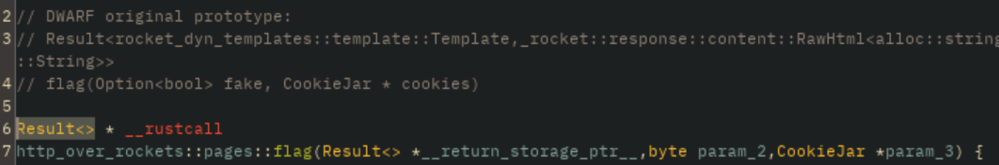

# RFC 9452 bis IP over Rockets with Quality of Service
Reverse de serveur Rust ([rocket.rs](https://rocket.rs/))

## Énoncé
Un beau jour d'avril, un ami de longue date vous fait part d'un projet sur lequel travaillent ses collègues, et qui pourrait vous intéresser : la transmission de paquets IP par fusée.

Il insiste pour que vous jetiez un coup d'œil au site du projet, qui ne devrait pas tarder à être déployé, et vous donne de quoi le faire tourner localement en attendant.

## Structure
- 📄 `README.md` : ce fichier (je sais, choquant.......)
- 📄 `rfc.zip` : le challenge, un zip généré par `make_chall.sh` dans la pipeline du repo originel.
- 📄 `make_chall.sh` : script permettant de rassembler tous les éléments permettant de faire tourner le serveur dans `rfc.zip`
- 📁 `src` : le code source du site
- 📁 `static` : le contenu statique servi par le site, actuellement une unique image
- 📁 `templates` : les templates de rendu de page
- 📁 `images_writeup` : les images utilisées dans le writeup qui suit
- 📁 `xorbluxator2000` : le projet rust qui m'a servi pour générer les strings obfusquées ainsi que le flag. Ne faites pas attention au choix des noms de variable, ils sont parfaitement normaux et adaptés.

## Déroulé/Writeup
### Préambule
- dézipper rfc.zip
- un premier lancement avec `strace` révèle un `bind(9, {sa_family=AF_INET, sin_port=htons(8000), sin_addr=inet_addr("127.0.0.1")}, 16) = 0`: le serveur tourne donc en localhost sur le port 8000, ce qui sera aisément vérifié par la suite. On peut désormais admirer la page d'accueil \:)

### Analyse statique
On peut donc entamer un début d'analyse statique. Un lancement d'analyse dans Ghidra est un bon départ. D'autres outils marcheront également mais le support rust n'est généralement pas aussi bon.

#### Basiques de rétro-ingénierie Rust
- Comme pour tout binaire rust, on trouvera alors dans la section "namespace" du "symbol tree" de ghidra un namespace correspondant au nom du binaire (qui s'il n'a pas été modifié, est le nom du projet), contenant également une fonction `main`.
- Un des premiers calls y étant fait étant pour une fontion du namespace `rocket` et on retrouve également ce nom abondamment dans les noms de fonction sous ce namespace. Après une courte recherche sur les interwebs on tient le framework utilisé pour ce challenge: `rocket.rs`.

#### Identification des routes 
- Toujours dans ce namespace, on trouvera un module `pages`, qui semble contenir la majorité des routes du serveur (dont celle d'accueil `index`, qui ne fait que faire le rendu de la template du même nom, trouvable dans le dossier templates)
- À chaque fonction est lié une "classe" (du moins d'après ghidra) du même nom, contenant deux fonctions `into_info` et `into_route`, mais surtout toutes les "closures" (i.e. fonctions anonymes) utilisées dans la route.

#### La fonction `http_over_rockets::pages::flag()`
Dans ce module `http_over_rockets::pages`, on trouvera une route au nom fort intéressant: `flag`.  
Comme le binaire a été gentiment compilé en mode débug, ghidra réussit à extraire les infos Dwarf correspondant à la signature de la fontion:

Après une courte lecture de la documentation de rocket.rs, on peut donc en déduire que la fonction, et par extension la route, prend en paramètre un booléen optionnel `fake`, ainsi qu'une `CookieJar` (stockant les cookies) et renvoie un rendu de template ou du html brut.

On peut donc d'office se rendre sur `localhost:8000/flag?fake=false` eeet...  
La page renvoit
```
Bien essayé, mais ça va pas être aussi simple que ça...
```
On n'y est pas encore...

On peut donc commencer à regarder un peu ce qu'il se passe réellement dans la fonction décompilée.
- Le premier if/else opère sur notre paramètre `Optional<bool> fake`, et avec un peu de dynamique et/ou d'intuition/d'espérience avec le reverse rust, on déduira qu'il faut que ce paramètre soit à false pour qu'on rentre, dans la suite du code, dans la branche qui s'occupe du cookie.
- Par lecture rapide dans ghidra, on verra que le nom du cookie attendu est `mucho secret`, et, en regardant les éléments de la comparaison opérée par `::core::cmp::impls::eq<str,_str>()`, que la valeur attendue est `cm9ja2V0ID0gdnJvb20gdnJvb20gPSBmYXN0ID0gZ29vZCBmb3IgaW50ZXJuZXQ=`

On peut donc rajouter ce cookie dans notre navigateur pour cette page, à l'aide de l'outil d'inspection, on rafraîchit, et on tombe sur la page suivante:

Une inspection du contenu html montre que le bouton "montrer" renvoie le contenu de la grille centrale par une requête POST sur... `/flag`???

On a alors épuisé tout le code décompilé de la fonction `flag`, on peut en déduire qu'il doit y avoir une autre fonction qui correspond à cette route pour une requête POST.

####  La fonction `http_over_rockets::pages::test()`
On peut la trouver de différentes manières. Une des plus propres à mes yeux est d'utiliser `rust-gdb` (normalement fourni par rustup et/ou rust) et de mettre des breakpoints sur les 2 autres fonctions pas encore utilisées de `http_over_rockets::pages` puis d'appuyer sur le bouton "montrer". On est alors en pause dans `http_over_rockets::pages::test()`. Trouvé !

Toujours avec le prototype dwarf, on constatera que la fontion prend en entrée un `Referer`, structure non définie par rocket.rs, mais qui devrait faire référence au header du même nom si le concepteur du chall est gentil (il l'est \:) ), ainsi qu'un `Form<Vec<bool>>` (en enlevant le gras).

> petite précision, le header referer correspond à l'url depuis laquelle est accédée la page actuelle.

On peut profiter du fait d'être en dynamique dans la bonne fonction pour voir le résultat du premier appel à `deobfuscate` (la string "pas comme ça...", sans doute liée aux fails), puis on se rendra compte que ce referer, une fois passé dans la fonction `obfuscate` est comparé à une suite de bytes arbitraire.

Pour des raisons de rapidité je passerai l'algorithme exact de cette fonction `obfuscate`, que vous pourrez retrouver dans le code source de ce repo :)

Après reverse de cette fonction (ou un peu d'intuition, de patching et utilisation de la fonction `deobfuscate` du binaire, déjà existante), on trouvera qu'il faudra que le referer soit `http://localhost:8000/flag?fake=false&hehe_sneaky_me` pour que la fonction procède à la vérification du contenu de la grille.

Après lecture attentive du code (dont les fonctions `closure` de la classe `test`) la traitant, on trouvera que celle-ci est en fait un [picross](https://fr.wikipedia.org/wiki/Picross): une liste (`bouibouiboui`, ou `local_8f8` dans Ghidra) contient les nombres de carrés à aligner, et une autre (`bouidoups`, ou `local_881` dans Ghidra) contient un booléen déterminant s'il y a une (false) ou deux (true) groupes de carrés remplis par ligne/colonne (on traite séquentiellement les 12 lignes puis les 12 colonnes). Ce après quoi un chiffré AES 192 sera déchiffré en utilisant comme clé notre entrée et comme IV une valeur fixe.

Tout cela donne donc


Et voilà le flag qui apparaît!

## Flag
`404CTF{p0issON_r0u1llé_d_4vr1L}`
